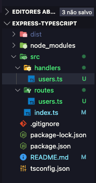

# Tutorial Passo-a-passo de TypeScript e Express.js

- O comando abaixo vai criar o diretório do projeto e metrando na pasta.

```bash
 mkdir nome-do-projeto && cd nome-do-projeto

```

- O comando abaixo inicia o package.json

```bash
npm init -y

# a flag '-y' aceita todas as perguntas do package.json

```

- O comando abaixo instala a biblioteca do TypeScript ao projeto

```bash
npm i -D typescript
# A flag '-D' instala qualquer biblioteca como dependência de desenvolvimento

```

- O comando abaixo instala a biblioteca do Express no projeto

```bash
npm i express
# Vamos adicionar também as tipagens para o express
npm i -D @types/express

```

- Crie um novo diretório chamado "src"

```bash
mkdir src
```

- Crie também um arquivo dentro do diretório "src" chamado 'index.ts'.

```bash
touch index.ts
```

- No arquivo 'index.ts', vamos adicionar o seguinte código:

```bash
import express from "express";

const app = express();

const port = 3000;

app.listen(port, () => {
    console.log(`Running on port ${port}`)
```

- Vamos iniciar o arquivo do **tsconfig.json**, com um comando bem simples:

```bash
npx tsc --init
```

- No arquivo **tsconfig.json**, vamos descomentar a linha onde tem o comando **"rootDir": "./"** e vamos adicionar **src** apos a barra, **"rootDir": "./src"**.

- Vamos adicionar também o comando **"outDir": "./"**, e adicionar dist a o path, o nome do diretório pode ser o que voce quiser, mas o de senso comum seria 'dist'.
  **"outDir": "./dist"**.

- Futuramente, usaremos mais esse arquivo, por hora ja basta.

- Agora vamos buildar o projeta para o typescript usando o comando:

```bash
npx tsc --build
```

- Esse comando cria o diretório **dist** e transpila nosso código typescript para javascript.

```js
"use strict";
var __importDefault =
  (this && this.__importDefault) ||
  function (mod) {
    return mod && mod.__esModule ? mod : { default: mod };
  };
Object.defineProperty(exports, "__esModule", { value: true });
const express_1 = __importDefault(require("express"));
const app = (0, express_1.default)();
const port = 3000;
app.listen(port, () => {
  console.log(`Running on port ${port}`);
});
```

- Dessa forma podemo executa nosso projeto usando o comando:

```bash
node ./dist/index.js
```

- Para facilitar, vamos criar um alias no package.json desse comando para buildar e executar o projeto:

```json
 "scripts": {
    // Esses dois comandos
    "build": "tsc --build",
    "start": "node dist/index.js"
  },

```

- Agora vamos instalar o **nodemon**, uma ferramenta que da auto reload na aplicação, sem a
  necessidade de finalizar e iniciar novamente.

```bash
npm i -D nodemon
```

- Vamos adicionar também, a biblioteca do **ts-node**, para que o **nodemon** reconheça os arquivos typescript:

```bash
npm i -D ts-node
```

- Agora, vamos fazer as mudanças necessárias para o **nodemon** funcionar automaticamente.
  No arquivo **package.json**, vamos adicionar o comando:

```json
"scripts": {
    "start:dev": "nodemon ./src/index.ts"
  },
```

## Criando Rotas

- Agora vamos aprender como usar rotas para simplifica e nao deixar todo o código em um único arquivo. Crie uma pasta no diretório **src** com o nome **routes**, dentro de routes vamos criar uma arquivo chamado **users.ts**,
  sera a primeira rota da aplicação.

- Dentro do arquivo users.ts, vamos adicionar esse código:

```ts
import { Router } from "express";

const router = Router();

router.get("/");

export default router;
```

- No arquivo **index.ts** vamos adicionar as linhas:

```ts
import userRouter from "./routes/users";

app.use("/api/users", userRouter);
```

- Agora vamos criar o diretório **handlers**, nele vamos criar o arquivo **users.ts**.

## Método get

- Um exemplo simples de como adicionar um endpoint `GET` usando Express.js:

```typescript
import express, { Request, Response } from "express";

const app = express();
const port = 3000;

// Rota GET para a raiz da aplicação
app.get("/", (req: Request, res: Response) => {
  res.send("Bem-vindo à minha aplicação!");
});

// Rota GET para '/api/users'
app.get("/api/users", (req: Request, res: Response) => {
  // Supondo que aqui você tenha uma função que retorna os usuários do seu sistema
  const users = [
    { id: 1, name: "Usuário 1" },
    { id: 2, name: "Usuário 2" },
    { id: 3, name: "Usuário 3" },
  ];
  res.json(users);
});

// Inicia o servidor
app.listen(port, () => {
  console.log(`Servidor rodando na porta ${port}`);
});
```

Neste exemplo:

- Temos duas rotas `GET`, uma para a raiz da aplicação (`"/"`) e outra para `"/api/users"`.
- Quando alguém acessa a raiz da aplicação, o servidor responde com uma mensagem de boas-vindas.
- Quando alguém acessa a rota `"/api/users"`, o servidor responde com um array de objetos JSON simulando uma lista de usuários.
- A função `res.send()` é usada para enviar uma resposta de texto simples, enquanto `res.json()` é usada para enviar uma resposta JSON.

Você pode adicionar este exemplo ao seu tutorial para mostrar como criar endpoints `GET` no Express.js.

## Handlers

- Criaremos um **Handlers** no projeto onde iremos criar todos os métodos para a rota **users**.

Seu projeto deve esta assim.



- Dentro de handlers/users, iremos adicionar os métodos para a rota **users**:

```ts
import { Request, Response } from "express";

// um método para o get
export function getUsers(req: Request, res: Response) {
  res.send([]);
}

// um método para o get by id
export function getUsersById(req: Request, res: Response) {
  res.send([]);
}
```
